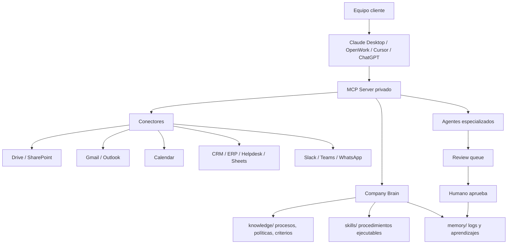

# Brain Commercial Notes

## Positioning

Brain vende una capa operativa para que una empresa convierta conocimiento, documentos y tareas repetidas en trabajo ejecutable por agentes, con revision humana y trazabilidad.

## Architecture Diagram

